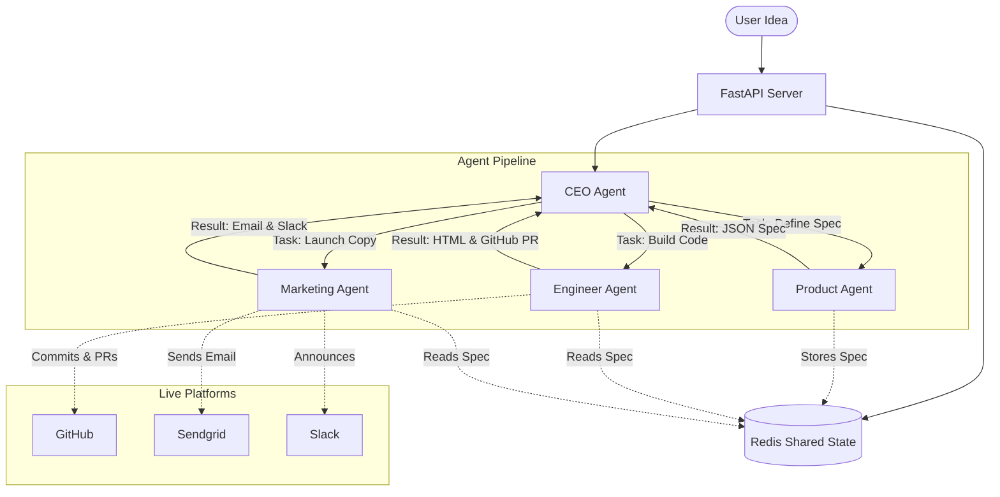

# LaunchMind: The Autonomous AI Startup Studio

LaunchMind is a Multi-Agent System (MAS) that autonomously builds a micro-startup from a single idea to a working product and market launch, requiring zero human intervention.

## The Startup: GradTrack
**GradTrack** is an AI-powered job application tracker tailored for final-year university students. It solves the chaos of managing dozens of job applications by providing an automated tracking board, smart deadline reminders, and an AI-assisted one-click follow-up generator, ensuring students never miss an opportunity.

## Architecture

Our Multi-Agent System operates using a dynamic sequential workflow orchestrated by a CEO agent. Agents communicate asynchronously via a Redis message bus, retaining full context of the startup idea and product specifications.



## System Agents

1. **CEO Agent**: The orchestrator. Decomposes tasks, validates output with an LLM-powered devil's advocate review, and directs the system loop. Can reject work and push agents into a revision loop if quality falls short.
2. **Product Agent**: Converts raw ideas into structured JSON product requirements, user personas, and feature priorities.
3. **Engineer Agent**: Automatically writes the underlying code (HTML/CSS) for a landing page and automatically commits, opens an issue, and submits a pull request to GitHub.
4. **Marketing Agent**: Automatically generates go-to-market copy, sends real cold outreach emails via SendGrid, and shares launch announcements internally via Slack.

## Setup Instructions

### 1. Prerequisites
- Python 3.10+
- Redis Server (local or remote)
- Valid API keys for Groq, Google AI Studio, GitHub, SendGrid, and Slack.

### 2. Installation
```bash
# Clone the repository
git clone https://github.com/launchmind-gradtrack/launchmind.git
cd launchmind

# Create and activate a virtual environment
python -m venv .venv
source .venv/bin/activate  # On Windows: .venv\Scripts\activate

# Install dependencies
pip install -r requirements.txt
```

### 3. Environment Configuration
Copy the sample environment file to `.env` and fill in your keys:
```bash
cp .env.example .env
```
Ensure you have the following configured in `.env`:
- `GROQ_API_KEY`
- `GOOGLE_API_KEY`
- `GITHUB_TOKEN`, `GITHUB_USERNAME`, `GITHUB_REPO`
- `SLACK_BOT_TOKEN`, `SLACK_CHANNEL_ID`
- `SENDGRID_API_KEY`, `SENDGRID_FROM_EMAIL`, `SENDGRID_TO_EMAIL`
- Redis connection strings (`REDIS_HOST`, `REDIS_PORT`)

### 4. Running the System
Start the FastAPI server:
```bash
uvicorn main:app --reload
```
Open a browser and navigate to `http://localhost:8000` to access the Command Center UI and launch your AI startup.

## Platform Integration Links
As the Multi-Agent system works, it interacts natively with the following external APIs:
- [GitHub Repository](https://github.com/) - Issue creation, Git branches, File commits, Pull Request management.
- [Slack Block Kit](https://api.slack.com/block-kit) - Automated internal status updates.
- [SendGrid v3 API](https://sendgrid.com/solutions/email-api) - Outreach and user onboarding.

## Project Deliverables
- **GitHub PR Link**: [Wait for run to generate PR](#)
- **Live UI Demo**: Included via FastAPI WebSockets at `/frontend/index.html`
